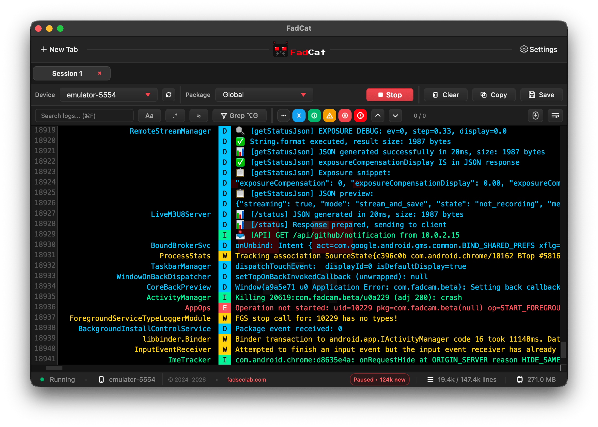
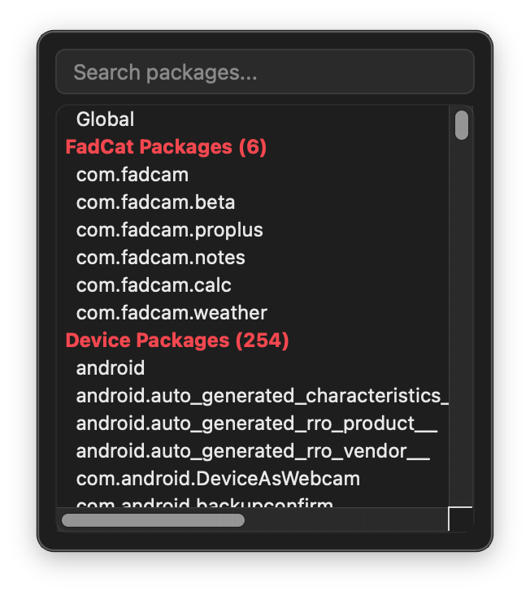
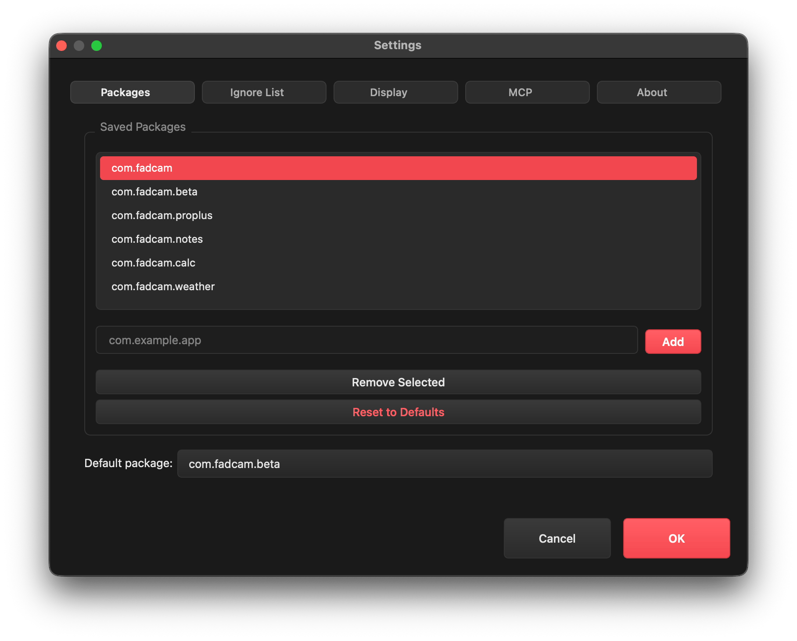
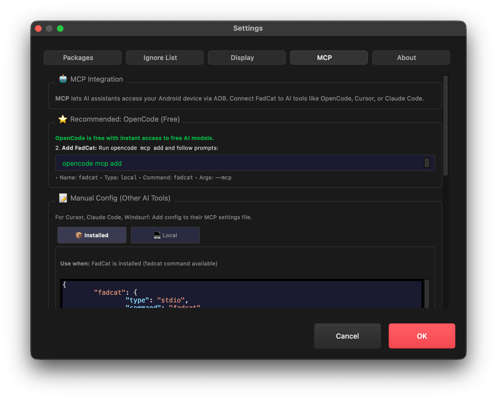
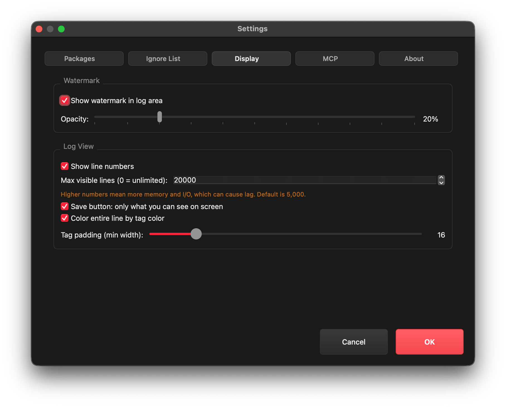

<div align="center">


# `>_` FadCat

FadCat is a lightweight, feature-rich, cross‑platform Android logcat replacement for Android Studio, without the bloat. It bundles ADB for supported architectures and runs in GUI, CLI, or MCP server mode.

[](https://github.com/anonfaded/FadCat/releases/)
[](https://www.patreon.com/cw/Fadedx/shop)
[](https://discord.gg/kvAZvdkuuN)


</div>

## `>_` 📱 Screenshots

<div align="center">
<table>
  <tr>
    <td align="center">
      
      <br><sub><b>Main FadCat GUI window</b><br>Multi-device logcat, color-coded logs, and search</sub>
    </td>
    <td align="center">
      
      <br><sub><b>Package picker</b><br>Quickly filter and select app packages</sub>
    </td>
  </tr>
  <tr>
    <td align="center">
      
      <br><sub><b>Settings</b><br>Customize logcat display, ignored tags, and UI options</sub>
    </td>
    <td align="center">
      
      <br><sub><b>MCP server</b><br>Automation, device/media inspection, and FadCam integration</sub>
    </td>
  </tr>
  <tr>
    <td align="center" colspan="2">
      
      <br><sub><b>Advanced customization</b><br>Tailor FadCat to your workflow</sub>
    </td>
  </tr>
</table>
</div>

<p align="center">
  
</p>
</div>

</div>

> [!Tip]
> This project is part of the [FadSec Lab suite](https://github.com/fadsec-lab). <br> Discover our focus on ad-free, privacy-first applications and stay updated on future releases!

FadCat also ships **specialized FadCam media tools** to browse and pull FadCam media for backups.  
FadCam repository: [FadCam](https://github.com/anonfaded/FadCam)

| ⭐ | | *From the FadSec-Lab suite:* <br> Also, check out our Desktop app/file/folder locker: [FadCrypt](https://github.com/anonfaded/FadCrypt) |
|--|-------------|:---------------------------------------------------------------------------------------------------------------------------------------------------------------|

## `>_` Features
- **Multi‑device logcat sessions**: dedicated tabs per device/session
- **Search with modes**: regex, fuzzy search, grep mode, and case toggle
- **Highlighting**: matches are highlighted with clear current‑match focus
- **Log level chips**: filter by V/D/I/W/E/F instantly
- **Package picker**: searchable package list for fast targeting
- **Visual clarity**: colored log levels/tags and readable UI defaults
- **Customizable**: tag padding, ignored tags, and UI options via settings
- **Bundled ADB**: architecture‑aware selection without relying on system ADB
- **MCP server**: AI assistants can inspect devices, logs, processes, and media
- **FadCam integration**: browse and pull FadCam media for backups
- **Cross‑platform utility**: macOS, Linux, and Windows

## `>_` What FadCat Is For
FadCat is designed for fast daily Android debugging: logcat exploration, device inspection, and structured AI workflows via MCP.  
It is also a **specialized companion for FadCam**, built to browse and manage FadCam media and pull backups to your PC.

There are many logcat wrappers, but most are CLI‑heavy and feel too manual for daily work.  
FadCat adds a clean, feature‑rich GUI with options that are easy to use.

## `>_` Modes

### `>_` GUI (default)
```bash
fadcat
```

### `>_` CLI
```bash
fadcat --cli
```

### `>_` MCP Server (stdio)
```bash
fadcat --mcp
```

## `>_` MCP Overview
FadCat exposes a FastMCP server so AI assistants can use FadCat’s MCP tools.

**Core MCP capabilities**
- Device discovery and system info
- Logcat streaming and search
- App process inspection
- FadCam media browsing and selective pulls

**Roadmap direction**
FadCat MCP is evolving toward more autonomous Android workflows. Planned areas include:
- Device automation and capture flows (e.g., integration with open‑source tools like scrcpy)
- APK‑level inspection and reverse‑engineering helpers
- Richer device diagnostics and automated debugging routines

## `>_` MCP Setup (IDE)
**Recommended: OpenCode (Free)**
1. Run: `opencode mcp add`
2. Use:
   - Name: `fadcat`
   - Type: `local`
   - Command: `fadcat`
   - Args: `--mcp`

**Manual Config (Other AI Tools)**
Add one of the following MCP configs in your IDE settings:

**Installed (recommended)**
```json
{
  "fadcat": {
    "type": "stdio",
    "command": "fadcat",
    "args": ["--mcp"],
    "env": {"PYTHONUNBUFFERED": "1"}
  }
}
```

<details>
<summary>Local Dev (run from source)</summary>

```json
{
  "fadcat": {
    "type": "stdio",
    "command": "/opt/homebrew/bin/python3",
    "args": ["-m", "src.mcp"],
    "env": {
      "PYTHONUNBUFFERED": "1",
      "PYTHONPATH": "/path/to/FadCat"
    }
  }
}
```

Notes:
- Replace `command` with your Python path from `which python3`.
- Replace `PYTHONPATH` with the path where you cloned the FadCat repo.
</details>

On macOS, the CLI command is registered on first launch.

## `>_` MCP Prompt Examples

### `>_` FadCam MCP
- `Browse FadCam beta camera recordings in internal storage.`
- `Browse FadCam Pro+ recordings on the SD card.`
- `Browse FadCam media and tell me total videos and space used.`
- `Browse the forensic gallery, then pull the latest 5 forensic snapshots.`
- `Pull this exact file: FadCam_YYYYMMDD_HHMMSS.mp4`

### `>_` General MCP
- `Summarize the latest logcat warnings and errors.`
- `Analyze app crash logs and suggest the root cause.`
- `List connected devices and show device details.`
- `Show system info and storage stats for the selected device.`

## `>_` 📱 Screenshots

<div align="center">
  <br><br>
  
  <div><em>Main FadCat GUI window: multi-device logcat, color-coded logs, and search features</em></div>
  <br><br>
  
  <div><em>Package picker: quickly filter and select app packages for targeted logcat</em></div>
  <br><br>
  
  <div><em>Settings: save packages for quick access, adjust ignored tags</em></div>
  <br><br>
  
  <div><em>MCP server: automation, device/media inspection, and FadCam integration</em></div>
  <br><br>
  
  <div><em>Display: customize fadcat display</em></div>
  <br>
</div>

## `>_` ⬇️ Download

Download the latest release from the [releases page](https://github.com/anonfaded/FadCat/releases).

[](https://github.com/anonfaded/FadCat/releases)

## `>_` Join Community
Join our [Discord server](https://discord.gg/kvAZvdkuuN) to share ideas, seek help, or connect with other users. Your feedback and contributions are welcome!

[](https://discord.gg/kvAZvdkuuN)

## `>_` Support & Shop

Support development via Patreon.

[](https://www.patreon.com/cw/Fadedx/shop)

<details>
<summary>Contributing and Requirements</summary>

**Contributing**
- Open an issue first to discuss the feature or fix.
- Fork the repo and create a feature branch.
- Commit your changes with a clear message.
- Open a pull request and link the related issue.

**Requirements**
- Python 3.8+ (built and tested on Python 3.14)
- Dependencies in `requirements.txt`

**Dev quick start**
```bash
pip3 install -r requirements.txt
python3 FadCat.py
```

**Build for Production**

| Platform | Command |
|----------|---------|
| **Windows** | `powershell -ExecutionPolicy Bypass -File .\build\windows\build.ps1` |
| **macOS** | `bash build/macos/build.sh` |
| **Linux** | `bash build/linux/build.sh` |

</details>

## `>_` Credits
- Built on top of [pidcat](https://github.com/JakeWharton/pidcat)

## `>_` License
Apache 2.0
